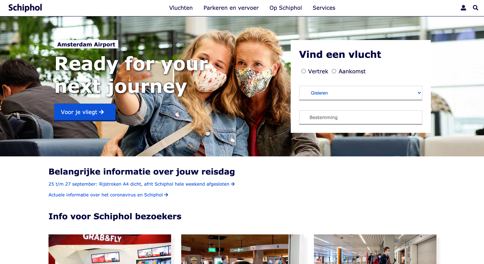

# Procesverslag
**Auteur:** -Muhammet Komur-

Markdown cheat cheet: [Hulp bij het schrijven van Markdown](https://github.com/adam-p/markdown-here/wiki/Markdown-Cheatsheet). Nb. de standaardstructuur en de spartaanse opmaak zijn helemaal prima. Het gaat om de inhoud van je procesverslag. Besteedt de tijd voor pracht en praal aan je website.

## Bronnenlijst
1. https://schiphol.nl/
2. https://fonts.google.com/
3. https://www.w3schools.com/
4. https://css-tricks.com/snippets/css/complete-guide-grid/
5. https://fontawesome.com/

## Herkansing (week -)
- Ik had een 6 gehaald. Om een hoger cijfer te krijgen heb ik verbeteringen toegepast aan mijn website. Ik heb gewerkt aan de tab index voor de blinde gebruikers. Na dat ik dat gefixt had, heb ik bijvoorbeeld dubbele ID's etc verwijderd en aangepast. Ook heb ik alt teksten toegevoegd aan afbeeldingen. Verder heb ik voor de herkansing mijn website upgeload bij validator.w3.org en heb ik de andere overige erros opgelost. Verder heb ik kleine CSS aanpassingen gemaakt (de puntjes op de i gezet). Daarnaast heb ik ook de readme bestand aangevuld zoals u kunt lezen :) -

## Eindgesprek (week 7/8)

-laatste puntjes op de i gezet, de website had ik afgemaakt en gecontroleerd op de responsiveheid. Met media queries had ik de website volledig repsonsive gemaakt en de laatste css aanpassingen had ik ook gedaan-

**Screenshot(s):**

-screenshot(s) van je eindresultaat-

## Voortgang 3 (week 6)

-verbeteringen gebracht aan de website-
-footer afgemaakt, ik had ul's toegevoegd in de footer en met flexbox vormgegeven-

## Voortgang 2 (week 5)

-ik was bezig met de hamburger menu. Dat heb ik met javascript gemaakt. De hamburger knop is een checkbox. Als die getoggled, geklikt wordt wordt de class displaynone weggehaald of toegevoegd met een if-else statement. en ik was met grid en flexbox aan het spelen, dus had ik me daar in meer verdiept-

## Voortgang 1 (week 3)

### Stand van zaken

-ik was bezig om alle html elementen op de juiste plek toe te voegen en daarna te stijlen. Ik was dus bezig om alle HTML elementen op de juiste plaats te zetten en daarna te gaan stijlen-

## Intake (week 1)

**Je startniveau:** -rood-

**Je focus:** -responsive-

**Je opdracht:** -link naar de website die je gaat namaken óf de naam van je eigen ontwerp-
https://www.schiphol.nl/

**Screenshot(s):**

